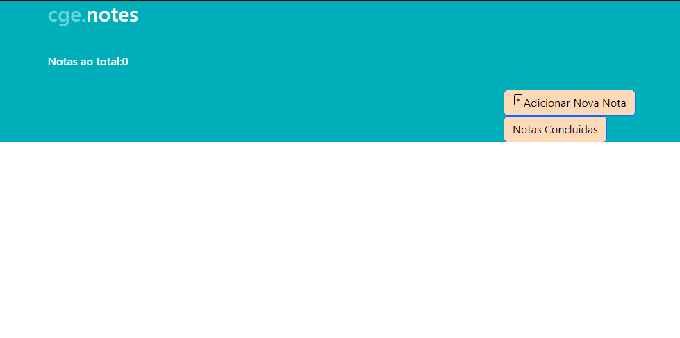
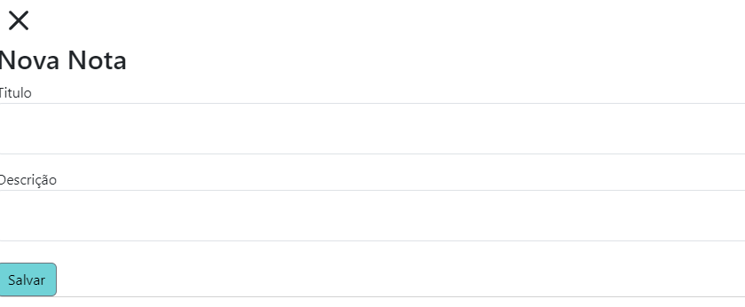
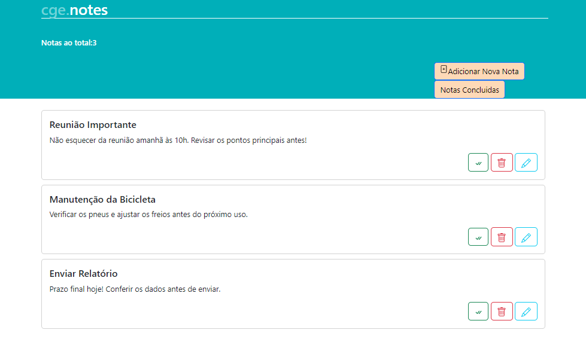
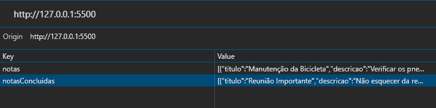

# CGE-Notas
Repositorio CGE Estagio 

Página de notas criadas a partir da IDE Visual Studio Code, utilizando a extensão Live Server.

Funcionamento da página:

Adicionar uma nova nota:
Ao clicar no botão “Nova nota”, aparecerão dois campos para escrita, onde é possível preencher o título da nova nota e a descrição. 

Ao salvar, a nota irá aparecer na página principal em formato de card.

No card aparecerá:
O título da nota com a descrição.
Três botões com as seguintes opções:
Botão verde: Marca a nota como concluída.
Botão vermelho: Excluir nota.
Botão azul: Editar nota.

Formato de Armazenamento: Local Storage
Notas criadas estão sendo salvas no local storage chamado ‘Notas’.
Notas concluídas estão sendo salvas no local storage chamado ‘Notas Concluídas’.
